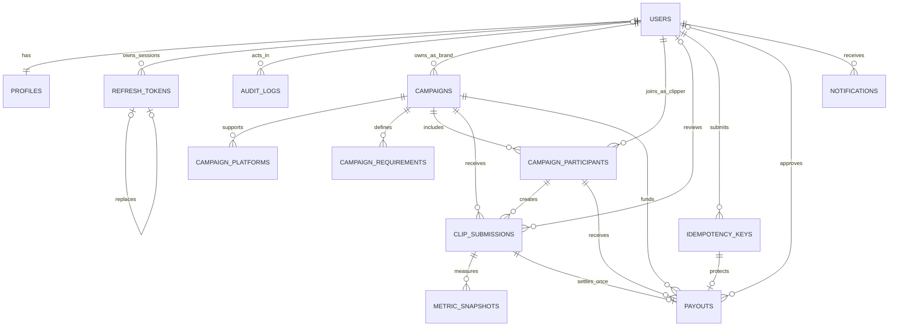

# KlipForge database schema

## Scope

Phase 2A provides the normalized PostgreSQL schema, reversible SQL migrations, and deterministic local-development fixtures. It does not implement authentication endpoints, JWTs, refresh-token rotation, RBAC middleware, dashboards, or payout processing.

All identifiers are PostgreSQL UUIDs. Monetary values use `numeric`, never floating-point types. Statuses and platform values use text columns with `CHECK` constraints so future migrations can evolve values without PostgreSQL enum changes.

## Migration convention

Migrations live in [`migrations/`](../migrations) as ordered pairs:

```text
000001_description.up.sql
000001_description.down.sql
```

The project-native `klipforge-migrate` runner records versions in `schema_migrations` and applies each file in a PostgreSQL transaction. `down` rolls back one most-recent migration at a time.

## Entity relationship diagram



## Tables

| Table                   | Purpose                                                                       |
| ----------------------- | ----------------------------------------------------------------------------- |
| `users`                 | Normalized account identity, role, active state, and bcrypt password hash.    |
| `profiles`              | One-to-one display profile owned by a user.                                   |
| `refresh_tokens`        | Hashed, replaceable refresh tokens grouped by session and token family.       |
| `campaigns`             | Brand-owned campaign lifecycle, financial limits, and date range.             |
| `campaign_platforms`    | Supported platform set per campaign.                                          |
| `campaign_requirements` | Ordered, typed delivery requirements per campaign.                            |
| `campaign_participants` | A clipper's unique campaign membership and participation state.               |
| `clip_submissions`      | A participant's submitted content URL, review state, and reviewer context.    |
| `metric_snapshots`      | Immutable engagement counts captured for a submission at a point in time.     |
| `idempotency_keys`      | Actor-scoped request keys for future sensitive operations.                    |
| `payouts`               | One payout record per submission, tied to its valid campaign and participant. |
| `notifications`         | Read/unread user notifications with structured JSON context.                  |
| `audit_logs`            | Historical actor snapshots and append-only action records.                    |
| `schema_migrations`     | Internal migration-runner ledger.                                             |

## Domain values

| Domain             | Allowed values                                        |
| ------------------ | ----------------------------------------------------- |
| User role          | `ADMIN`, `BRAND`, `CLIPPER`                           |
| Campaign status    | `DRAFT`, `ACTIVE`, `PAUSED`, `COMPLETED`, `CANCELLED` |
| Participant status | `PENDING`, `ACCEPTED`, `DECLINED`, `REMOVED`          |
| Submission status  | `PENDING`, `APPROVED`, `REJECTED`, `FLAGGED`          |
| Payout status      | `PENDING`, `APPROVED`, `PROCESSED`, `FAILED`          |
| Platform           | `TIKTOK`, `INSTAGRAM`, `YOUTUBE`                      |
| Idempotency status | `IN_PROGRESS`, `COMPLETED`, `FAILED`                  |

## Integrity rules

- `users.email` is unique and must equal its trimmed, lowercase representation.
- `refresh_tokens.token_hash` is unique; raw refresh tokens are never stored. Each row carries `session_id`, `family_id`, `issued_at`, `expires_at`, optional rotation/revocation state, a replacement link, and safe client metadata.
- A rotation row cannot record `rotated_at` without `replaced_by_token_id` (or vice versa). Session and active-family indexes support state validation, logout, and theft response.
- `campaign_participants` has a unique `(campaign_id, clipper_id)` pair.
- `clip_submissions.content_url` is unique and must be trimmed.
- Campaign budget, remaining budget, CPM, and maximum payout per clip are non-negative. Remaining budget cannot exceed total budget.
- Campaign end date must be after start date.
- Metric counts are non-negative `bigint` values.
- A submission's `(participant_id, campaign_id)` is a composite foreign key to the matching campaign participant.
- A submission's `(campaign_id, platform)` is a composite foreign key to a platform enabled for that campaign.
- A payout has one submission only and a composite foreign key to the exact submission, campaign, and participant. This prevents cross-campaign and duplicate payout records structurally.
- A payout has a unique idempotency key; `idempotency_keys` is also unique per actor, scope, and request key.
- Notifications retain an explicit nullable `read_at` state.
- Audit records retain actor email, role, action, entity type, entity ID, and metadata even if the actor account is later removed.

## Referential actions

- User profiles and notifications cascade with their owning user.
- Refresh-token records cascade with their owner; a replacement reference is set to null if its replacement is removed.
- Campaign platforms and requirements cascade with their campaign.
- Campaign participants cascade with their campaign, but user, submission, payout, and idempotency relationships use `RESTRICT` where deletion would invalidate historical or financial records.
- Reviewer and payout approver references use `SET NULL`, retaining the historical review or payout record.
- Metric snapshots cascade with their submission.
- Audit actor references use `SET NULL` while actor snapshot fields remain intact.

## Indexes

The schema adds indexes for the principal operational paths:

- active users by role; active refresh tokens by user; and refresh-token session, family, and active-family lookup;
- audit actor, action, and entity history;
- campaigns by brand/status/date and by status/date;
- a clipper's campaign participations and campaign submission queues;
- submission metric history;
- payout queues by campaign and participant status;
- unread and historical notifications by user;
- idempotency-key expiration cleanup.

## Development seed data

`klipforge-seed` inserts fixed UUID fixtures and upserts them by ID, so it is safe to run repeatedly without duplicating records. Password hashes are fixed bcrypt hashes; passwords are never stored in plaintext.

The local-development-only credentials are:

| Role    | Email                     | Password      |
| ------- | ------------------------- | ------------- |
| Admin   | `admin@klipforge.local`   | `Admin123!`   |
| Brand   | `brand@klipforge.local`   | `Brand123!`   |
| Clipper | `clipper@klipforge.local` | `Clipper123!` |

These credentials are intentionally public fixtures for local development only. They must never be deployed to staging or production.

The fixture set includes 1 admin, 3 brands, 8 clippers, 6 campaigns across draft/active/paused/completed/cancelled states, campaign members, pending/approved/rejected/flagged submissions, metric snapshots, payout records, notifications, idempotency keys, and audit examples.

## Docker Compose workflow

The migration and seed binaries are built into the API image and exposed as Compose `tools` profile services. From PowerShell, use the existing local defaults when no private `.env` file is present:

```powershell
$env:DOCKER_CONFIG = Join-Path $env:TEMP 'klipforge-docker-config'
docker compose --env-file .env.example up -d postgres redis
docker compose --env-file .env.example --profile tools run --rm migrate up
docker compose --env-file .env.example --profile tools run --rm migrate status
docker compose --env-file .env.example --profile tools run --rm seed
```

To roll back the most recently applied migration:

```powershell
docker compose --env-file .env.example --profile tools run --rm migrate down
```

To reset local development data, remove Compose volumes, then reapply migrations and seed. This deletes local PostgreSQL and Redis data:

```powershell
docker compose --env-file .env.example down --remove-orphans --volumes
docker compose --env-file .env.example up -d postgres redis
docker compose --env-file .env.example --profile tools run --rm migrate up
docker compose --env-file .env.example --profile tools run --rm seed
```
